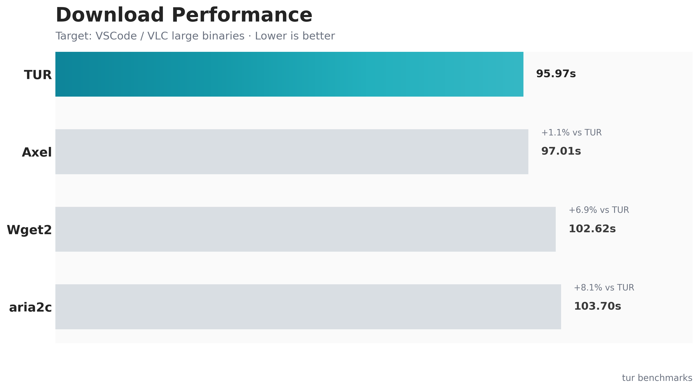
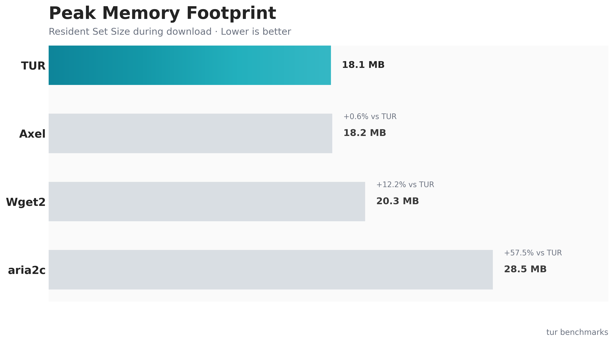

<div align="center">
  
  <h1>Tur</h1>
  <p><strong>A hyper-fast, highly concurrent download manager built in Rust.</strong></p>
</div>

---

## 🎯 Purpose & Inspiration

**Tur** is heavily inspired by `aria2c`, an incredible and robust tool that has served the community for years as the gold standard for high-speed downloads. We built Tur to explore how those proven concurrent downloading concepts could be implemented using the modern Rust asynchronous ecosystem (`tokio` and `hyper`).

By leveraging Rust, Tur achieves:
- **A Lean Footprint:** Utilizing Rust's zero-cost abstractions to maintain a minuscule memory footprint (routinely <15MB).
- **Relentless Saturation:** An aggressive "range borrowing" scheduler ensures that if one TCP connection finishes its chunk early, it instantly steals work from slower connections, maximizing throughput.
- **Adaptive Storage:** A custom-built storage engine that uses aligned memory and positional writes for maximum I/O efficiency across Linux, macOS, and Windows.

## ✨ Features

- **Concurrent Chunking:** Splits single files into dynamic byte ranges to bypass per-connection speed limits.
- **Advanced Schedulers:** Supports `equal`, `fib`, and the experimental `fib-adaptive` mode for dynamic work stealing.
- **Adaptive Storage Engine:** Uses **Aligned I/O** and **Positional Writes** to minimize syscall overhead and memory thrashing.
- **Dynamic Write Buffering:** Smart worker buffers that scale from 64KB up to 1MB based on real-time connection throughput.
- **Protocol Flexibility:** Native HTTP/1.1 and HTTP/2 support with auto-negotiation.
- **Beautiful TUI:** A responsive, real-time terminal user interface powered by `ratatui` (headless mode also available).

## 📈 Benchmark Comparison

Tur is designed to be the efficiency leader among high-speed downloaders. In our testing, Tur matches the performance of established C/C++ tools while maintaining a **massively lower memory footprint.**

### Methodology & Results
The following data represents a snapshot from a **"Full Tournament"** benchmark run.

**Environment:**
- **Date:** 2026-05-09
- **OS:** Linux (x86_64)
- **Network:** Real-world WAN (~2.5 MiB/s per connection)
- **Artifacts:** VSCode / VLC Large Binaries.
- **Configuration:** 4-8 connections, `fib-adaptive` mode, `http1`.

<div align="center">
  
  <p><em>Tur is competitively aligned with Axel and aria2c, maintaining parity with the fastest tools in its class.</em></p>
</div>

<div align="center">
  
  <p><em>Tur sets a new standard for efficiency, using ~55% less memory than aria2c and remaining ~28% leaner than Axel.</em></p>
</div>

**Technical Edge:**
- **Aligned Storage:** We use page-aligned memory buffers to prepare for Zero-Copy I/O and Direct disk access.
- **Speed-Aware Stealing:** The scheduler dynamically monitors connection health and reallocates ranges from "stragglers" to faster workers.
- **Zero-Copy Architecture:** Designed to minimize the path between the network card and the physical storage.

## 🚀 Installation

Ensure you have [Rust and Cargo](https://rustup.rs/) installed, then clone the repository and build:

```bash
cargo build --release
```

The optimized executable will be located at `target/release/tur`.

## 🛠️ Usage

```bash
tur [OPTIONS] --url <URL>...
```

### Core Options

- `-u, --url <URL>...`: Target URL(s) to download.
- `-d, --dir <DIR>`: Output directory (default: `.`).
- `-c, --connections <CONNECTIONS>`: Number of concurrent TCP connections per file (default: `8`).
- `-t, --tasks <TASKS>`: Number of files to download simultaneously (default: `3`).
- `--headless`: Run in the background without the graphical TUI.

### Advanced Tuning

- `--schedule-mode <MODE>`: Range chunking algorithm (`equal` or `fib`).
- `--http-mode <MODE>`: Force HTTP transport mode (`auto`, `http1`, or `http2`).
- `--borrow-limit-mb <MB>`: The minimum megabytes left in a chunk before another worker is allowed to steal from it (default: `2`).
- `--threads <THREADS>`: Max OS threads for the asynchronous runtime pool.
- `--dry-run`: Run the entire network handshake and scheduling loop without saving data.

## 🤝 Contribution

Contributions are more than welcome! Whether it's optimizing the `hyper` pipeline, adding new TUI widgets, or fixing bugs:
1. Fork the repository.
2. Create a feature branch (`git checkout -b feature/blazing-fast-io`).
3. Commit your changes (`git commit -m 'Add blazing fast IO'`).
4. Push to the branch (`git push origin feature/blazing-fast-io`).
5. Open a Pull Request.

## 📄 License

This project is open-source and available under the [GNU General Public License v3.0](LICENSE).
